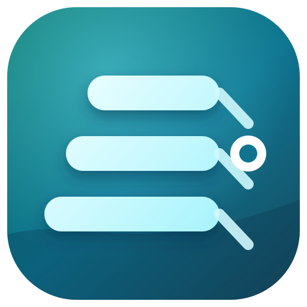
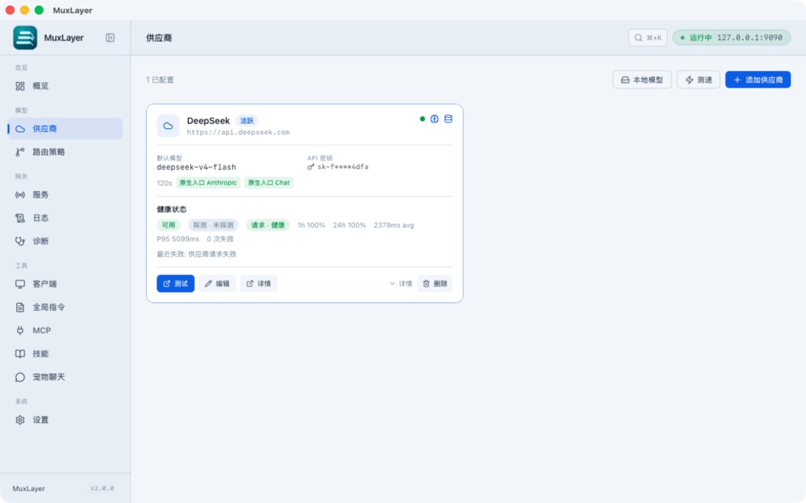
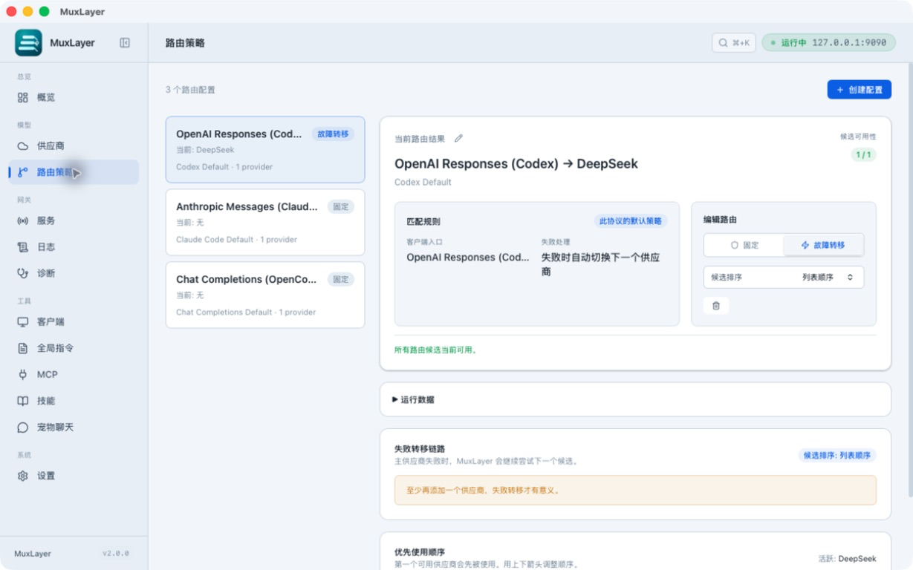
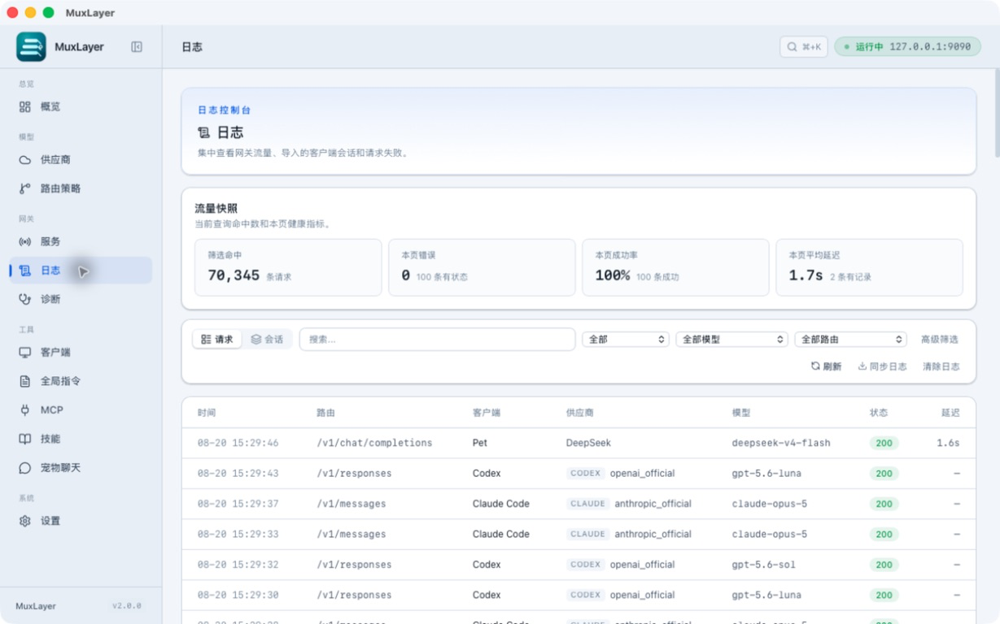

<p align="center">
  
</p>

<h1 align="center">MuxLayer</h1>

<p align="center">
  <b>The local model control layer for coding agents.</b><br>
  MuxLayer sits between your coding agents and AI model providers. Route, convert,
  fail over, and trace model requests locally.
</p>

<p align="center">
  Codex · Claude Code · Gemini CLI · OpenCode · CodeLeveler<br>
  DeepSeek · Kimi · MiMo · OpenAI · Anthropic · OpenRouter · Ollama · 20+ providers
</p>

> MuxLayer — formerly AgentGate

<p align="center">
  <a href="https://github.com/dengmengmian/muxlayer/releases"></a>
  <a href="https://github.com/dengmengmian/muxlayer/stargazers"></a>
  <a href="https://github.com/dengmengmian/muxlayer/releases"></a>
  <a href="./LICENSE"></a>
</p>

<p align="center">
  <a href="./README_ZH.md">中文</a> · <a href="https://github.com/dengmengmian/muxlayer/releases">Download</a> · <a href="#5-minute-quick-start">5-Minute Quick Start</a> · <a href="./docs/full-reference.md">Full Reference</a> · <a href="https://github.com/dengmengmian/muxlayer/discussions">💬 Discussions</a>
</p>

<p align="center">
  GitHub: <a href="https://github.com/dengmengmian/muxlayer">dengmengmian/muxlayer</a>
</p>

<p align="center">
  
</p>

> **New in v2.0.0 — MuxLayer brand migration with automatic legacy data adoption:** Existing desktop installations keep their update identity and data directory, while new headless installs use `~/.muxlayer` and automatically continue using an existing `~/.agentgate` database or token. [See the v2.0.0 release notes](./docs/release-notes/2.0.0.md).

## Download

| Your machine | Download |
|---|---|
| macOS Apple Silicon | [MuxLayer 2.0.0](https://github.com/dengmengmian/muxlayer/releases/download/v2.0.0/MuxLayer_2.0.0_aarch64.dmg) |
| macOS Intel | [MuxLayer 2.0.0](https://github.com/dengmengmian/muxlayer/releases/download/v2.0.0/MuxLayer_2.0.0_x64.dmg) |
| Windows 10 / 11 | [MuxLayer 2.0.0](https://github.com/dengmengmian/muxlayer/releases/download/v2.0.0/AgentGate_2.0.0_x64-setup.exe) |
| Debian / Ubuntu | [MuxLayer 2.0.0](https://github.com/dengmengmian/muxlayer/releases/download/v2.0.0/AgentGate_2.0.0_amd64.deb) |
| Other Linux distros | [MuxLayer 2.0.0](https://github.com/dengmengmian/muxlayer/releases/download/v2.0.0/AgentGate_2.0.0_amd64.AppImage) |

**Windows install note:** Edge/Chrome may say the file is “usually not downloaded,” and SmartScreen may show **Windows protected your PC**. That is expected: the installer is not Authenticode-signed. There is no free, widely trusted Windows code-signing certificate (Let’s Encrypt only covers HTTPS, not `.exe`), so open-source builds often ship unsigned — this is **not** a virus report. Download only from [GitHub Releases](https://github.com/dengmengmian/muxlayer/releases). In the browser choose **Keep** / **Keep anyway**, then when SmartScreen appears click **More info** → **Run anyway**.

On macOS you can also install with Homebrew:

```bash
brew install --cask dengmengmian/tap/agentgate
```

The Homebrew cask name and existing installer filenames remain `agentgate` during
the compatibility phase. They will migrate separately with an upgrade path.

Headless CLI (`agentgate-serve`) tarballs and older versions are on the [Releases](https://github.com/dengmengmian/muxlayer/releases) page.

## Why MuxLayer

| Official experience intact | Model routing is yours | Every request visible |
|:---|:---|:---|
| Keeps Codex / Claude Code / Gemini CLI / OpenCode / AtomCode usable the way you already use them, with one-click restore to official configs. | Official client requests enter MuxLayer first, then route through protocol conversion or native pass-through to the upstream provider you choose. | Route decisions, converted payloads, upstream errors, tokens, cost, latency, and failover attempts are traced locally. |

MuxLayer is not a hosted API reseller or a generic proxy. It is a local entry point for AI model requests — every request enters MuxLayer first, then routes, converts, fails over, or passes through under your control.

## Three focused tools, one workflow

**CodeLeveler writes the code. ReviewGate reviews it. MuxLayer connects both
to your model APIs.** Each tool works independently, or they can be used
together:

| Tool | Focus |
|---|---|
| **MuxLayer** | Adapt model APIs behind one local gateway |
| [CodeLeveler](https://github.com/dengmengmian/CodeLeveler) | Inspect, edit, run, and verify code in the terminal |
| [ReviewGate](https://github.com/dengmengmian/ReviewGate) | Review code changes and surface high-confidence issues |

## 5-Minute Quick Start

1. Download and install MuxLayer.
2. Open **Quick Setup** or **Providers**, then paste your provider API key.
3. Click **Start Gateway** on **Overview** or **Gateway**. The default endpoint is `127.0.0.1:9090`.
4. On **Clients**, click **Apply Config** for Codex, Claude Code, OpenCode, Gemini CLI, or AtomCode.
5. Send a test message in the client. Use **Switch to Official** or history rollback whenever you want to restore the original config.

Provider presets fill common base URLs, protocols, model defaults, and capability matrices. Most users do not need to touch model mapping or advanced endpoint fields at first.

## Common Uses

| Goal | What MuxLayer does |
|---|---|
| Use Codex with DeepSeek or MiMo | Lets Codex keep sending official Responses API traffic, then converts or passes it through to the selected upstream. |
| Keep Codex Desktop plugins working | Preserves the official OpenAI-authenticated provider path while routing model requests through MuxLayer. |
| Use Claude Code with DeepSeek / MiMo / Copilot | Supports Anthropic-compatible pass-through, model-name mapping, and optional GitHub Copilot provider setup. |
| Avoid provider outages or quota stalls | Tries failover providers on configured status codes, keywords, timeouts, and cooldown state. |
| Keep long AI tasks running unattended | Prevents automatic sleep on macOS and Windows by default, with optional request-aware control and quick system-tray toggles. |
| Understand every request | Stores raw and converted payloads, route decisions, upstream errors, token counts, latency, and estimated cost. Diff raw vs converted bodies and export a redacted repro package for issue reports. |
| Cap daily spend | Optional daily budget gate with `notify only` / `block` / `force cheapest` policies. Only new requests are gated; in-flight streams are never cut mid-response. |
| Keep a conversation on one provider | Session affinity sticks a multi-turn chat to the upstream it started on, so cache hits and behavior stay consistent. Failover and force-cheapest still override it. |
| Run local models | Scans Ollama / LM Studio and other common local OpenAI-compatible ports, then adds them as providers in one click. |
| Send upstream calls through a local proxy | Settings → Outbound HTTP proxy. `http://` / `https://` only (Clash / V2Ray). Loopback stays direct. Empty URL means the switch does nothing; off keeps using `HTTP(S)_PROXY` from the environment. |
| Route by what the request actually contains | Route conditions (input size, images, tools, system keywords, model name) now apply to Chat Completions, Anthropic Messages, and Gemini, not only Codex Responses. |

<details>
<summary>Supported providers</summary>

<!-- PROVIDER_CATALOG_TABLE:START -->
| Provider | Type | Native Protocols | Provider-Specific Handling |
|---|---|---|---|
| Xiaomi MiMo | `mimo` | Chat + Anthropic | Multi-turn `reasoning_content` round-trip, region-aware `tp-*` host auto-routing, temperature strip in thinking mode, tool_choice non-auto strip, omni web_search strip, web_search builtin gated by matrix, Web Search Plugin auto-degrade / retry |
| DeepSeek | `deepseek` | Chat + Anthropic | Image stripping with explicit notice, DeepSeek V4 thinking history reasoning backfill, schema cleaning, message reordering |
| Anthropic (Claude) | `anthropic` | Anthropic | `tool_use`/`tool_result`, `input_schema`, thinking budget, native cache_control |
| GitHub Copilot | `copilot` | Chat + Anthropic | GitHub token → Copilot bearer exchange, `x-initiator` billing classification, Claude model dash→dot normalization |
| OpenAI | `openai` | Chat + Responses | None (Responses passthrough or Chat conversion) |
| Google Gemini | `google_gemini` | Chat | None |
| Kimi / Moonshot | `kimi` | Chat + Anthropic | `web_search` → `builtin_function`/`$web_search`; K3 uses `reasoning_effort:max` (no K2 `thinking` param); coding models keep thinking on/off control |
| MiniMax | `minimax` | Chat | Strip reasoning_effort / response_format, `<think>` extraction |
| GLM (Zhipu) | `glm` | Chat | Generic |
| DashScope (Qwen) | `dashscope` | Chat | Generic |
| SiliconFlow | `siliconflow` | Chat | Generic |
| Volcengine (Doubao) | `volcengine` | Chat | Generic |
| Baichuan | `baichuan` | Chat | Generic |
| StepFun | `stepfun` | Chat | Generic |
| SenseNova | `sensenova` | Chat | Drops null strict / response_format / non-function tools, merges system messages |
| Yi (01.AI) | `yi` | Chat | Generic |
| ModelScope | `modelscope` | Chat | Generic |
| xAI (Grok) | `xai` | Chat | Generic |
| Mistral | `mistral` | Chat | Generic |
| Groq | `groq` | Chat | Generic |
| Together | `together` | Chat | Generic |
| Fireworks | `fireworks` | Chat | Generic |
| Cerebras | `cerebras` | Chat | Generic |
| Perplexity | `perplexity` | Chat | Generic |
| Cohere | `cohere` | Chat | Generic |
| OpenRouter | `openrouter` | Chat | None |
| Custom | `custom_openai_compatible` | Chat | None (set Base URL yourself) |
<!-- PROVIDER_CATALOG_TABLE:END -->

</details>

## Guides

- [Codex Desktop plugins with third-party APIs](./docs/use-codex-desktop-with-third-party-api-and-plugins.md)
- [Codex + DeepSeek](./docs/use-codex-with-deepseek.md)
- [Codex + Xiaomi MiMo](./docs/use-codex-with-mimo.md)
- [Claude Code + DeepSeek](./docs/use-claude-code-with-deepseek.md)
- [Claude Code + GitHub Copilot](./docs/use-claude-code-with-github-copilot.md)
- [Gemini CLI](./docs/use-gemini-cli-with-agentgate.md)
- [OpenCode](./docs/use-opencode-with-agentgate.md)
- [Cursor / Continue / Cline](./docs/use-cursor-continue-cline-with-agentgate.md)
- [Local models (Ollama / LM Studio)](./docs/use-local-models-with-agentgate.md)
- [Full reference](./docs/full-reference.md)

## Screenshots

| Dashboard | Providers |
|---|---|
|  |  |

| Routes | Logs |
|---|---|
|  |  |

## Notes

- Brand migration and compatibility boundaries: [MuxLayer brand migration plan](./docs/brand-migration.md)
- GitHub Copilot provider support is optional. Using Copilot subscriptions outside official clients may carry account risk; read the dedicated guide before enabling it.
- The gateway endpoint is `127.0.0.1:9090`; `localhost:1420` is only the development UI port.
- MuxLayer is local-first and single-user. If you operate a shared API server or billing platform, tools like one-api, new-api, or LiteLLM may fit better.

## Development

```bash
pnpm install
pnpm tauri dev
```

Useful checks:

```bash
pnpm test
pnpm build
cd src-tauri && cargo test
```

## Community

- Questions and setup help: [Discussions](https://github.com/dengmengmian/muxlayer/discussions)
- Bugs and provider requests: [Issues](https://github.com/dengmengmian/muxlayer/issues)
- Contributing: [CONTRIBUTING.md](./CONTRIBUTING.md)

## License

MIT
